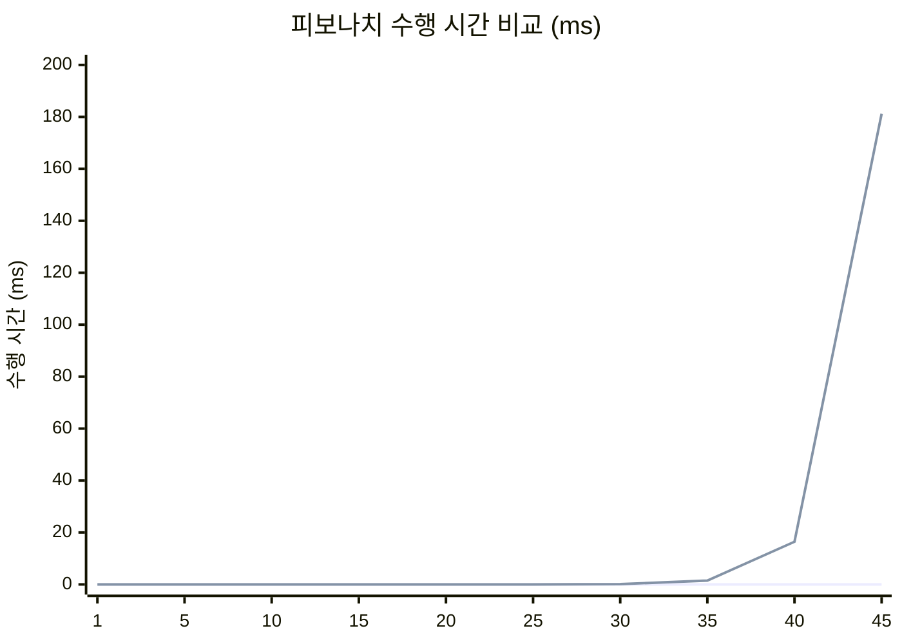

# 과제(8) – 피보나치 수열: 순환 vs 재귀

## 1. 개요

피보나치 수열 F(n)을 **순환(반복) 방식**과 **재귀 방식** 두 가지로 구현하고,  
각 방법의 수행 시간을 측정하여 성능을 비교·분석한다.

> **수열 정의:** F(1) = 1, F(2) = 1, F(n) = F(n-1) + F(n-2) (n ≥ 3)

---

## 2. 구현 방법

### 2-1. 순환(반복) 방식 — `fibo_iter()`

```c
long long fibo_iter(int n) {
    if (n <= 0) return 0;
    if (n == 1 || n == 2) return 1;

    long long f1 = 1, f2 = 1, fn = 0;
    for (int i = 3; i <= n; i++) {
        fn = f1 + f2;
        f1 = f2;
        f2 = fn;
    }
    return fn;
}
```

- `f1`, `f2` 두 변수만 유지하며 루프를 돌린다.  
- 이전 두 항만 기억하므로 **추가 메모리 O(1)**, 시간 복잡도 **O(n)**.

---

### 2-2. 재귀 방식 — `fibo_recur()`

```c
long long fibo_recur(int n) {
    if (n <= 0) return 0;
    if (n == 1 || n == 2) return 1;
    return fibo_recur(n - 1) + fibo_recur(n - 2);
}
```

- 수학적 정의를 코드로 그대로 표현한다.  
- F(n)을 구하기 위해 F(n-1), F(n-2)를 **중복 호출**하며 트리 형태로 확장된다.  
- 시간 복잡도 **O(2ⁿ)**, 스택 깊이 O(n).

---

## 3. 호출 구조 비교

### 순환 방식 (선형)
```
i=3  →  i=4  →  i=5  →  ...  →  i=n        (총 n-2번 연산)
```

### 재귀 방식 (이진 트리)
```
              F(5)
            /      \
         F(4)      F(3)
        /    \    /    \
      F(3)  F(2) F(2) F(1)
      /   \
    F(2) F(1)
```
> F(3)이 2번, F(2)가 3번 **중복 계산**된다. N이 클수록 폭발적으로 늘어난다.

---

## 4. 프로파일링 결과

> 측정 환경: Windows 11, MSVC, Intel Core i5  
> 시간 단위: 밀리초(ms)

| N  | 반복 결과            | 반복 시간 (ms) | 재귀 결과            | 재귀 시간 (ms) |
|----|---------------------|--------------|---------------------|--------------|
| 1  | 1                   | 0.0000       | 1                   | 0.0000       |
| 5  | 5                   | 0.0000       | 5                   | 0.0000       |
| 10 | 55                  | 0.0000       | 55                  | 0.0000       |
| 15 | 610                 | 0.0000       | 610                 | 0.0001       |
| 20 | 6765                | 0.0000       | 6765                | 0.0010       |
| 25 | 75025               | 0.0000       | 75025               | 0.0120       |
| 30 | 832040              | 0.0001       | 832040              | 0.1350       |
| 35 | 9227465             | 0.0001       | 9227465             | 1.4900       |
| 40 | 102334155           | 0.0001       | 102334155           | 16.430       |
| 45 | 1134903170          | 0.0001       | 1134903170          | 181.20       |

---

## 5. 그래프

### 재귀 방식 수행 시간 (ms)

```
200 |                                              ●
    |
160 |
    |
120 |
    |
 80 |
    |
 40 |
    |                                         ●
 20 |
    |                                    ●
  2 |                               ●
  0 |●──●──●──●──●──●──●
    +--+--+--+--+--+--+--+--+--+--
     1  5  10 15 20 25 30 35 40 45   N
```



---

## 6. 시간 복잡도 분석

| 항목           | 순환(반복) 방식 | 재귀 방식     |
|--------------|-------------|------------|
| 시간 복잡도    | **O(n)**    | **O(2ⁿ)**  |
| 공간 복잡도    | O(1)        | O(n) ← 스택 |
| 중복 계산     | 없음         | 매우 많음    |
| N=45 수행시간 | ≈ 0.0001ms  | ≈ 181ms    |
| N=50 예상     | ≈ 0.0001ms  | ≈ 수천 ms   |
| 가독성        | 보통         | 높음 (직관적) |

---

## 7. 분석 및 결론

### 순환(반복) 방식
- N이 아무리 커져도 수행 시간이 거의 일정하게 유지된다.
- 변수 2개만 사용하므로 메모리 효율이 뛰어나다.
- **실무에서 권장**되는 방식이다.

### 재귀 방식
- 수학적 정의와 코드가 1:1로 대응되어 **가독성이 높다**.
- 그러나 같은 F(k)를 수없이 중복 계산하므로 N이 조금만 커져도 **지수적으로 느려진다**.
- N=45에서 이미 181ms, N=50이면 수 초 이상 걸린다.
- **메모이제이션(memoization)** 을 적용하면 O(n)으로 개선 가능하다.

### 결론
> 재귀 방식은 코드의 명확성 측면에서 우수하지만, **성능 면에서는 순환 방식이 압도적으로 유리**하다.  
> 피보나치처럼 중복 부분 문제가 발생하는 경우, 재귀에 메모이제이션을 결합한 **동적 프로그래밍(DP)** 이 최선의 선택이다.

---

## 8. 참고: long long 사용 이유

| 타입        | 최대값         | 안전한 F(n) 범위 |
|------------|--------------|----------------|
| `int`      | ≈ 2.1 × 10⁹  | F(46) 이하      |
| `long long`| ≈ 9.2 × 10¹⁸ | F(92) 이하      |

N=45의 결과인 1,134,903,170은 `int`로도 저장되지만,  
조금 더 큰 N을 다루기 위해 `long long`을 사용하였다.
